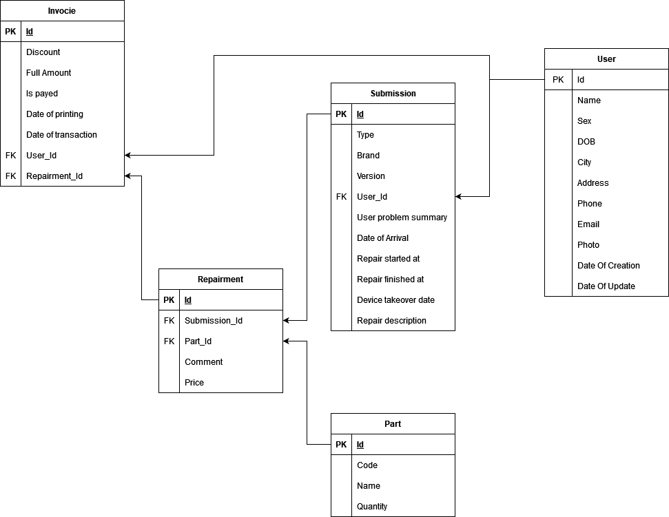

# QuickSave
Aplication for a pc repair shop

## Features

---

* User Management 
  * Users can put their device in to a system, which makes a database entry for it, after they bring it to the shop, worker makes a voucher and puts time of arrival, better problem description and estemated time of completion, users can cancel at any time by deliting their order, while woker can delete users if they seem as a problem which cancels their appointment as well
* Repairing devices
  * User marks their device as for repair and sends it
  * Worker starts a voucher, which he updates during the repair procces
  * At the end everything gets put on the bill and needs to be paid

## Database Model
---

## Technologies & languages

---

* MSSql
* Entity Framework
* Blazor

## Authors

---

| Name            | Github                                        |
| --------------- | --------------------------------------------- |
| Hrvoje Cukusic  | [GitHub](https://github.com/HrvojeCukusicOSS) |
